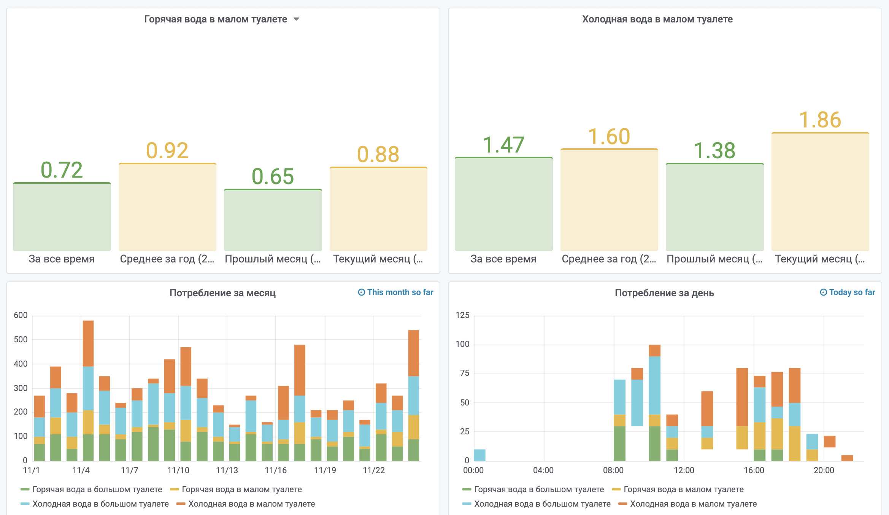

# ha_mosportal
Компонент для работы с сервисами моспортала (https://www.mos.ru):
1. получение pdf файла ЕПД
2. передача данных расхода воды. Есть поддержка нескольких счетчиков воды

**Инструкции**
1. Клонировать репозиторий [https://github.com/kkuryshev/ha_mosportal.git](https://github.com/kkuryshev/ha_mosportal.git)
2. Создать при необходимости папку "custom_components" и в нее скопировать папку "mosportal" и ее содержимое.
3. Добавить следующие настройки в основной файл конфигурации HAS "configuration.yaml". 

        mosportal:
          epd:
            topic_out: 'bot/infohub/in/home/info'
          meters:
            - name: input_number.big_restroom_water_cold_control_val
              meter_id: !secret meter_1
            - name: input_number.big_restroom_water_hot_control_val
              meter_id: !secret meter_2
            - name: input_number.small_restroom_water_cold_control_val
              meter_id: !secret meter_3
            - name: input_number.small_restroom_water_hot_control_val
              meter_id: !secret meter_4
          flat: !secret mosportal_flat
          paycode: !secret mosportal_paycode
          login: !secret mosportal_login
          password: !secret mosportal_passwd
          water_topic_out: 'bot/infohub/in/water/info'

4. Можно так же настроить задачу для автоматической отправки:

        - alias: Send meters value to mosportal
            trigger:
                - platform: time
                  at: '12:00:00'
            condition:
                - condition: template
                  value_template: "{{ now().day == 20 }}"
            action:
                - service: mosportal.publish_water_usage  #сервис, который публикует компонент 

4. Перезапустить Homeassistant
5. Вызвать сервис "mosportal.publish_water_usage". При этом нужно учитывать, что показания можно передавать в определенные дни (с 16 по 25 число месяца вроде).

Сенсоры:
Компонент поддерживает добавление сенсора для получения данных о переданных ранее показаниях воды. Для использования сенсоров нужно добавить следующую конфигурацию:
        - platform: mosportal
          name: <Название счетчика>
          meter_id: <Код счетчика>
На каждый счетчик нужно добавить свой сенсор.

--------------------- Пример полной автоматизации от получения данных от счетчика до передачи показаний на портал Москвы --------------
:
1. К герконам водяных счетчиков подключены микроконтроллеры, которые регистрируют импульсы (по два на каждые 10 литров воды - один логическая 1 и один логический 0). 
2. На каждый импульс генерируется сообщение, которое отправляется в mqtt топик, который слушает HomeAssistant (HA)
3. Для каждого счеткика в HA создан сенсор для регистрации импульса (Сами значения хранятся в influxdb для будущей аналитики в Grafana):
  
        - platform: mqtt
          name: "small_restroom_water_cold"
          availability_topic: "sh/restroom/small/water/availability"
          state_topic: "sh/restroom/small/water/cold/pulse"
          value_template: "{{ value_json.pulse | int }}"
          unit_of_measurement: "Pulses"

4. В HA созданы input_number для каждого счетчика для хранения актуального значения:
  
        big_restroom_water_cold_control_val:
            name: big_restroom_water_cold
            unit_of_measurement: m3
            step: 0.001
            min: 0
            max: 9999
            mode: box

5. Так же HA созданы правила (по одному для каждого счетчика), которое добавляет 10 литров воды к input_number. Важно, что фиксируем только импульсы с логической 1, так как из топика mqtt приходит два импульса. Это связано с необходимостью смены состояния сенсора, иначе не будет вызываться триггер:
  
        - alias: incriment small_restroom_water_cold
            trigger:
                - platform: numeric_state
                  entity_id: sensor.small_restroom_water_cold
                  value_template: "{{ states.sensor.small_restroom_water_cold.state | int }}"
                  above: 1
                  below: 11
            action:
                - service: input_number.set_value
                  data_template:
                    entity_id: input_number.small_restroom_water_cold_control_val
                    value: '{{ (states.input_number.small_restroom_water_cold_control_val.state | float + 0.01) | round(2) }}'

Такой подход позволяет имеет следующие преимущества:
1. В HA хранятся актуальные значения данных (легко сверить/отредактировать в случае необходимости):

2. Сами импульсы хранятся в influxdb с временной меткой, что позволяет сделать информативные отчеты:
